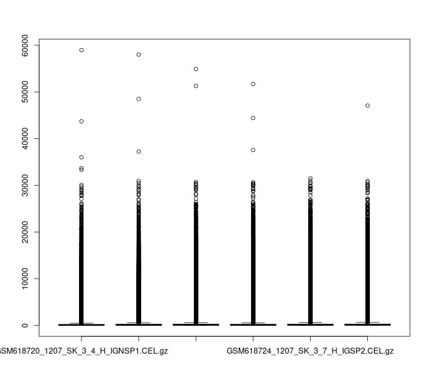
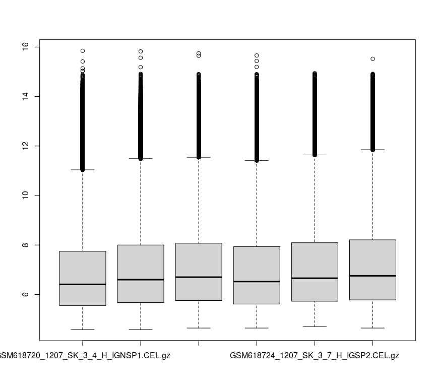

# Microarray with R
## Dependency

```
install.packages("BiocManager")
BiocManager::install("affy")
BiocManager::install("limma")
```

## Prepare Data

### Downloading data
* http://www.ncbi.nlm.nih.gov/geo/
* Enter GSE25191 into the field *keyword or GEO Accession* and press enter button
* or using the link https://www.ncbi.nlm.nih.gov/geo/query/acc.cgi?acc=GSE25191
* Uncompress the downloaded file *GSE25191_RAW.tar* into the same folder containing the code files

## Read Data
```
rawdata <- affy::ReadAffy() #read all .CEL.gz files
```

## Extract expression data
```
exprs <- affy::pm(rawdata)
```

## Data Visualization
## Plot MA plot
plot the first and the third chips
```
limma::plotMA(exprs[,c(1,3)])
```

## Scatterplots
```
plot(x=exprs[,1],y=exprs[,3])
```

## Compare 1st, 3th, and 6th chips
```
plot(x=exprs[,1],y=exprs[,6],col="blue")
points(x=exprs[,1],y=exprs[,3])
```

## Box plots
```
boxplot(exprs)
```


*Box plot of microarray expression*

```
boxplot(log(exprs,base=2))
```



*Box plot of Logarithm values of the microarray expression*